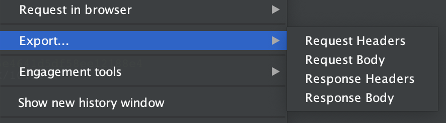

# Burp Easy Request Saver

This is an extension for [Burp Suite](https://portswigger.net/burp) that adds a context menu item to every request entry and request editor that allows you to easily export the request/response headers/body data to a file:

Single requests will be exported using the verbatim file name provided. Multiple requests will be saved as individual files in the same folder using the provided file name as a prefix. For instance, if you save multiple requests as `body.txt`, then the first request will be saved to `body - 1.txt`, the second to `body - 2.txt`, and so on.

## Installation

To install this extension, download the latest release from the Releases tab, then go to the Extender tab in Burp, click "Add", and navigate to where you downloaded the release to. 

## Development

This project uses Maven for dependency management, and includes IntelliJ project files; you can use either to build new versions. You may need to install my [Burp Extension Maven Archetype](https://github.com/ise-spolansky/burp-extension-maven-archetype) in order to build the project.